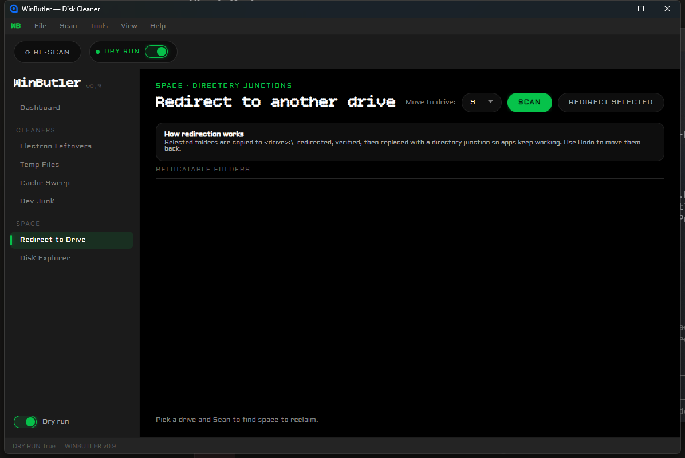

# WinButler

A disk cleaner and space-reclaim toolkit for Windows, built for machines with a chronically full system drive. It combines a real MFT-based disk scanner (WizTree-like — parses `$MFT` directly instead of walking the filesystem), a set of rule-driven cleaners for common junk (Electron app leftovers, temp files, caches, dev-tool bloat), and a directory-junction "redirect" feature that relocates heavy folders to another drive without breaking any app that expects them at their original path.

Dry-run is on by default everywhere. Nothing gets deleted or moved until you explicitly turn it off.

## Screenshots

| Dashboard | Dev Junk | Redirect to Drive |
|---|---|---|
|  |  |  |

The accent color (red or green LED) is swappable at runtime from the View menu — the Dashboard and Dev Junk screenshots above are in the default red, Redirect to Drive is in green.

## Features

- **Dashboard** — a system overview: total reclaimable space, total redirectable space, a disk-usage summary for the system drive, and per-category cards (Electron Leftovers / Temp Files / Cache Sweep / Dev Junk) that jump straight to that screen. "Clean All" runs every cleaner's selected items in one action.
- **Electron Leftovers** — detects old `app-x.y.z` build folders that Electron auto-updaters leave behind (VS Code, Discord, Slack, GitHub Desktop, etc.), keeps the newest version, and groups everything else by app for review.
- **Temp Files** and **Cache Sweep** — scan well-known temp and cache locations, classify every folder found via the rule engine described below, and let you select/clean by risk level.
- **Dev Junk** — per-tool cards (JetBrains, Android SDK, npm/yarn/pnpm, Cargo, Bun, vcpkg, and more) showing on-disk size vs. safely reclaimable size. Folders that look like a live git checkout (a `.git` subfolder) are automatically flagged 🔒 **Protected** and excluded from bulk cleaning. Each card also offers a one-click shortcut into the Redirect flow for tools too large to just delete from.
- **Redirect to Drive** — moves a folder to another drive and replaces it with a real NTFS directory junction, so every application still finds it at its original path. The flow is copy → verify (file count + byte count) → delete original → create junction, with a ledger recorded so any redirect can be undone later.
- **Disk Explorer** — a full drive breakdown (sortable list + treemap) built from a real NTFS `$MFT` parse, not a recursive directory walk — this is what makes it fast on drives with a very large number of files.

## Safety model

- **Dry-run is the default everywhere** and is a true no-op: the cleaner (`Services/Cleaner.cs`) returns before any filesystem mutation happens when dry-run is on.
- **Hybrid delete**: items classified `Safe` are deleted permanently (they're things like well-known GPU/shader caches); anything classified `Caution` or `Risky` goes to the Recycle Bin instead, so it's still recoverable.
- **Deny-list**: a fixed set of path fragments (SSH keys, GPG, credential stores, browser login/cookie data, etc.) is never touched, never even offered as a suggestion, regardless of what else matches.
- **Elevation**: the app requests `requireAdministrator` (see `app.manifest`) because it needs to reach all-user locations like `C:\Windows\Temp` and because creating/removing NTFS junctions requires elevated privileges. Expect a UAC prompt on launch.

## Architecture

Avalonia 12 (.NET 10, `net10.0`, Windows desktop) with MVVM via [CommunityToolkit.Mvvm](https://github.com/CommunityToolkit/dotnet). Views are resolved from ViewModels by name convention (`FooPageViewModel` → `Views/FooPageView.axaml`) via `ViewLocator.cs`.

```
Assets/Fonts/    Embedded fonts for the custom theme (see Fonts section below)
Controls/        Custom-drawn controls (e.g. TreemapControl for Disk Explorer)
Converters/      XAML value converters (risk color/label, toast kind, etc.)
Data/            definitions.json — the single source of truth for cache/redirect rules
Models/          Plain data types (CleanupTarget, RedirectCandidate, DevToolGroup, ...)
Services/        Scanners, the redirect service, the MFT parser, ThemeService, etc.
Themes/          The "Duly Doted" custom theme: color/typography/spacing tokens,
                 glow/dot-field effects, and one ControlTheme per control type
ViewModels/      One ViewModel per screen/component
Views/           One View (.axaml) per ViewModel, plus Views/Shared and Views/Shell
Tests/           xUnit test project (WinButler.Tests.csproj), excluded from the main build
```

The UI itself is a fully custom theme ("Duly Doted") rather than a stock control library: true-black canvas, six embedded fonts, and a single swappable LED accent color. `Services/ThemeService.cs` copies a precomputed Red or Green brush palette into a set of mutable resource keys that every screen binds to via `DynamicResource`, so the whole app re-colors live when you switch accents from the View menu — no restart needed.

## Configuration

`Data/definitions.json` is the single source of truth for both the cache-classification rules and the redirect catalog. It's embedded into the app as a resource and can be edited without recompiling (a `DefinitionsProvider` also supports layering in a remote source later, though that's off by default today). As of this writing it contains:

- **Cache rules**: 27 always-safe folder names, 53 safe-context path fragments, 2 caution names, 1 caution path fragment, and 11 deny fragments.
- **Redirect catalog**: 57 entries across 10 categories — Build tools, Node.js, Toolchains, IDEs, Python, ML caches, Web tooling, Games, Apps, and Misc dev.

## Getting started

**Prerequisites**: Windows 10+, [.NET 10 SDK](https://dotnet.microsoft.com/download), and admin rights (the app self-elevates via UAC on launch).

```bash
git clone <this-repo>
cd WinButler
dotnet build
dotnet run --project WinButler.csproj
```

## Testing

```bash
dotnet test Tests/WinButler.Tests.csproj
```

50 tests across 7 files (`CleanerTests`, `DefinitionsTests`, `DevJunkAggregatorTests`, `JunctionTests`, `MftReaderTests`, `RedirectionServiceTests`, `SafeCachesTests`). Expect this to take roughly a minute and a half — several tests exercise real filesystem scanning (the redirect candidate scan sizes real dev-tool folders, and the MFT tests read the real `$MFT` on `C:`), not mocked I/O.

## Fonts

The custom theme embeds six typefaces from Google Fonts, all under the SIL Open Font License: Aldrich, Bitcount Single, Doto, Geo, Pixelify Sans, and Press Start 2P.

## Known limitations

- The Dashboard's disk-usage bar shows Reclaimable / Other-used / Free rather than a full System vs. Apps vs. Media breakdown — a precise breakdown would need its own slow directory walk for a number that's mostly cosmetic.
- The Dashboard's "Session Activity" panel isn't wired to real clean/redirect completion events yet — it currently only shows the empty state.
- Geo, Pixelify Sans, and Press Start 2P are embedded but not yet used anywhere in the current UI (Aldrich, Bitcount Single, and Doto are the ones actually in use).
- There's no automated UI test suite; UI changes in this project are verified manually (build, run, screenshot, compare against the design).

## License

MIT — see [LICENSE](LICENSE).
