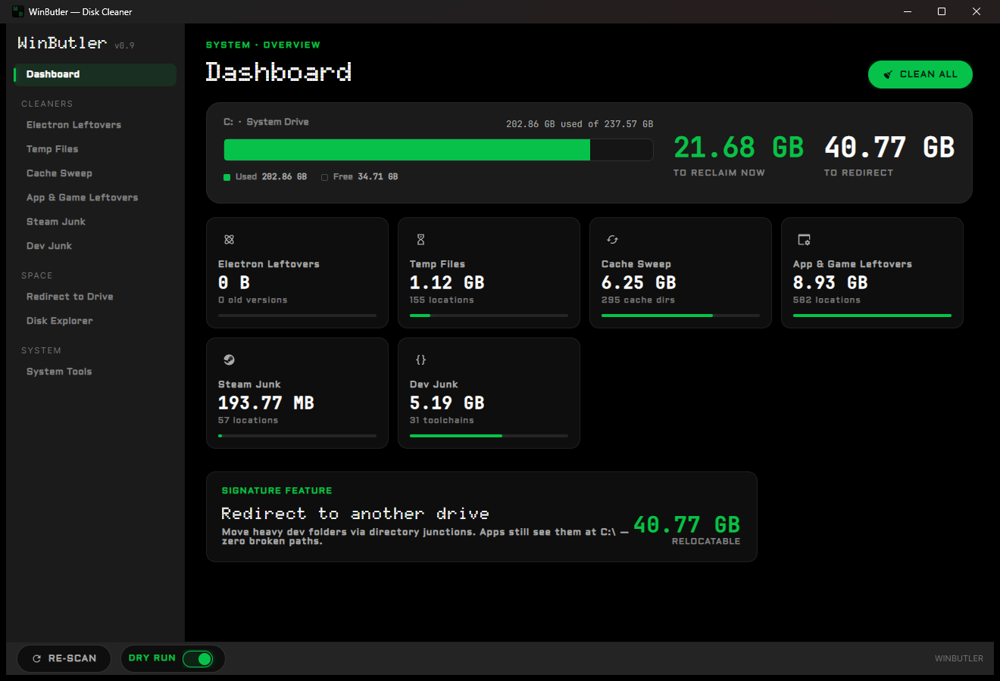
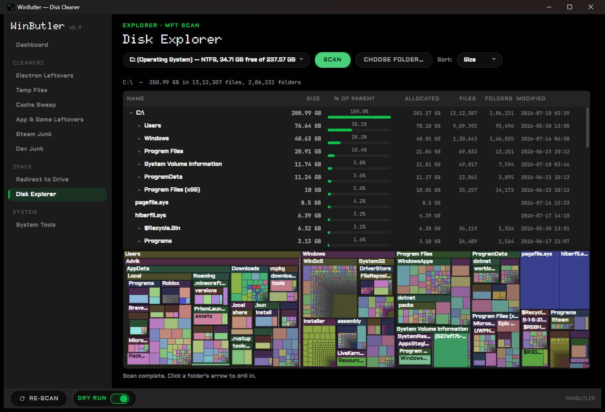
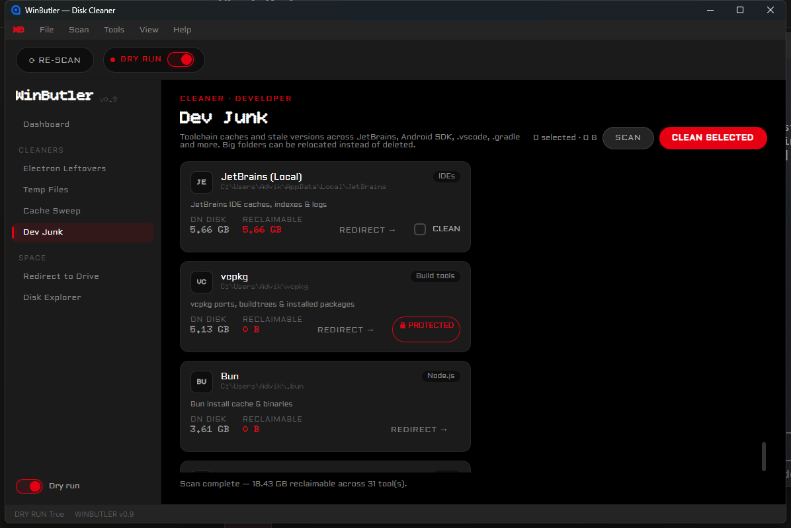
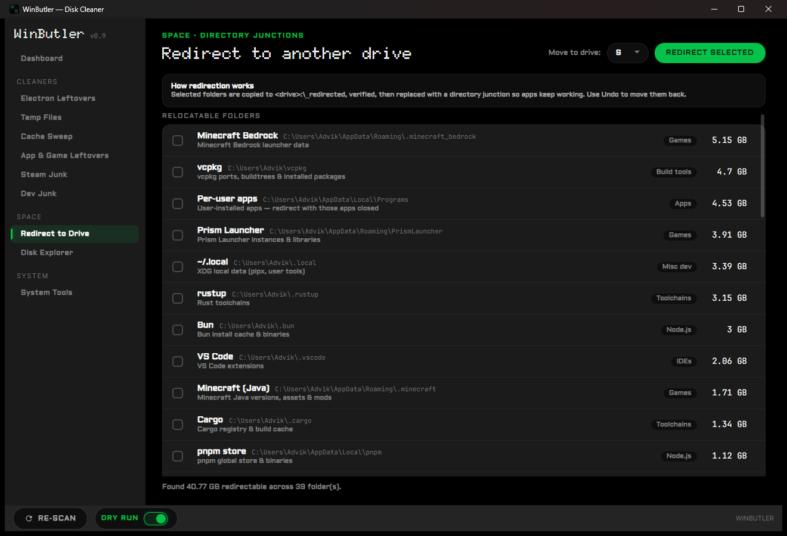

<div align="center">


# WinButler

**Reclaim your system drive.**

An MFT-fast disk scanner, rule-driven junk cleaners, and junction-based folder
redirection — built for Windows machines whose C: drive is chronically full.

[](https://github.com/Advik-B/WinButler/actions/workflows/build.yml)
[](LICENSE)


</div>

---

WinButler does three things most cleaners don't:

1. **It reads the NTFS `$MFT` directly** (like WizTree) instead of crawling the
   filesystem, so a full-drive scan of a million-file volume takes seconds, and every
   feature — cleaners, redirect sizing, the treemap — shares that one index.
2. **It moves heavy folders instead of just deleting them.** *Redirect to Drive*
   relocates a folder (an SDK, a package cache, a game) to another drive and leaves a
   real NTFS directory junction behind, so every app still finds it at its original
   path — with verification before anything is removed, and an undo ledger after.
3. **It is paranoid by design.** Dry-run is on by default and is a true no-op. A
   deny-list keeps SSH/GPG keys, credential stores, and browser login data from ever
   being *offered*, let alone touched. Risky items go to the Recycle Bin, not into the
   void. Every real deletion asks first and is logged.

## Screenshots

| Dashboard | Disk Explorer |
|---|---|
|  |  |
| **Dev Junk** | **Redirect to Drive** |
|  |  |

## Features

- **Dashboard** — total reclaimable and redirectable space at a glance, a disk-usage
  summary for the system drive, per-category cards that jump straight to each screen,
  and one-click *Clean All*.
- **Electron Leftovers** — finds the stale `app-x.y.z` build folders that Electron
  auto-updaters leave behind (VS Code, Discord, Slack, GitHub Desktop, …), keeps the
  newest version, and groups the rest by app for review.
- **Temp Files & Cache Sweep** — scan well-known temp and cache locations, classify
  every folder by risk through the JSON rule engine, and clean by risk level.
- **App & Game Leftovers** — a curated catalog of known junk locations *outside* the
  cache folders: crash dumps, installer leftovers, log piles, and drive-root debris.
- **Dev Junk** — per-tool cards (JetBrains, Android SDK, npm/yarn/pnpm, Cargo, Bun,
  vcpkg, …) showing on-disk size vs. safely reclaimable size. Anything that looks like
  a live git checkout is auto-locked out of bulk cleaning. Tools too big to clean get a
  one-click shortcut into the Redirect flow.
- **Steam** — finds every Steam library via `libraryfolders.vdf` and offers shader
  caches, download caches, dumps, and logs per library.
- **Redirect to Drive** — copy → verify (file count + byte count) → delete original →
  create junction, recorded in a ledger so any redirect can be undone later.
- **Disk Explorer** — a sortable full-drive breakdown plus a squarified treemap, built
  from the `$MFT` parse.
- **System Tools** — one-click DISM component cleanup, SFC, and Windows Update cache
  flush with live command output, plus an Explorer/MRU privacy sweep.

## The safety model

Cleaning tools earn trust by what they *refuse* to do:

- **Dry-run by default, every launch.** The dry-run switch resets to ON at startup —
  a real-delete session never carries over. In dry-run, the cleaner returns before any
  filesystem mutation happens.
- **Deny-list first.** Paths matching credential material (SSH, GPG, credential
  stores, browser login/cookie data, …) are excluded on every scan path.
- **Hybrid delete.** Only items classified *Safe* (well-known GPU/shader caches and
  the like) are deleted permanently; *Caution* and *Risky* items go to the Recycle Bin.
- **Junction-aware.** Delete paths never follow a reparse point into its target — a
  junction is unlinked, never traversed.
- **Confirm + log.** Every real destructive action shows a confirmation dialog stating
  exactly what will happen, and is written to `%APPDATA%\WinButler\logs`.

## Install

Grab **`WinButler-win.msi`** from the
[latest release](https://github.com/Advik-B/WinButler/releases/latest) and run it — no
.NET runtime required. It installs to `C:\Program Files\WinButler` (expect one UAC
prompt). Installed copies keep themselves current: WinButler checks for updates on
launch, downloads them in the background, and offers a one-click "restart to update"
(it never restarts on its own). Prefer no install? `WinButler-win-Portable.zip` runs
from anywhere (no auto-updates).

Windows 10/11 only. The app self-elevates via UAC on launch — it needs all-user temp
locations and NTFS junction privileges.

## Run from source

**Prerequisites:** Windows 10/11 and the [.NET 10 SDK](https://dotnet.microsoft.com/download).

```bash
git clone https://github.com/Advik-B/WinButler.git
cd WinButler
dotnet run --project WinButler.csproj
```

## Configuration

All cleaning rules, the redirect catalog, and the known-locations catalog live in JSON
under [`Data/definitions/`](Data/definitions/) — no rules are hardcoded. The format is
documented in [`Data/definitions/README.md`](Data/definitions/README.md); adding a new
cache rule or redirect target is a JSON edit, not a code change. The load is
fail-closed: if any definitions file is missing or unparseable, WinButler refuses to
scan at all rather than run with a partial deny-list.

## For developers

Architecture, build/test instructions, the testing strategy, and contributor gotchas
live in **[docs/DEVELOPMENT.md](docs/DEVELOPMENT.md)**. Want to contribute? Start with
**[CONTRIBUTING.md](CONTRIBUTING.md)** — the easiest PRs are new cleaning rules, and
they're pure JSON.

## Acknowledgements

The App & Game Leftovers catalog, the Steam-aware cleaning, and the System Tools page
began life as a study of [FocusedWolf](https://www.reddit.com/user/FocusedWolf/)'s
comprehensive Windows cleanup batch script, which WinButler absorbed into its native,
rule-driven (and dry-run-guarded) form. Thank you!

## License

MIT — see [LICENSE](LICENSE).
